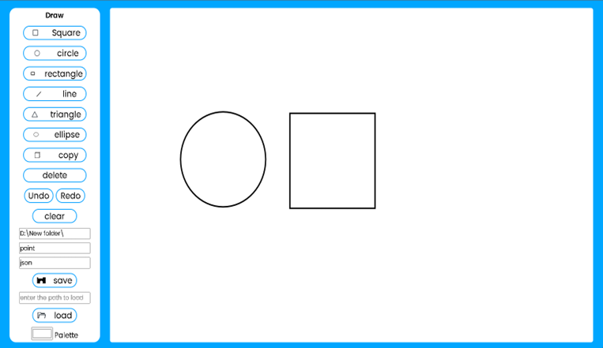

# Painter
A web-based drawing application, It allows the user to draw, color, resize, move, rotate, delete and copy different geometric shapes.
# Framworks
.  Angular 
.  Spring Boot
# Library
. KonvaJs
# UI ScreenShots
### Start

### Add Shapes

### Resize and rotate

### Drag and change color

### Save as Json

### Succesfully saved

